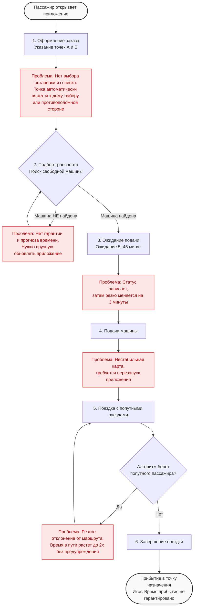

# AS-IS: текущее состояние сервиса заказных перевозок «По пути»

Процесс описан по материалам кейса и встречи. Шаги 1 и 2 следуют из описания сервиса, остальные восстановлены со слов заказчика.

## Текущий процесс поездки

1. **Оформление заказа.** Пассажир указывает точки отправления и прибытия в приложении. Явного списка остановок нет, точка подбирается автоматически и может привязаться к дому, ограждению или противоположной стороне улицы.
2. **Подбор транспорта.** Система ищет автобус среди свободных на данный момент машин. Если свободного транспорта нет, пассажир не получает гарантированного времени, когда транспорт появится. Пользователю приходится периодически обновлять приложение, чтобы проверить наличие автобуса. Если автобус доступен, пассажир может оформить поездку.
3. **Ожидание.** Время ожидания составляет от 5 до 45 минут. Статус в приложении может длительное время не меняться, а затем резко измениться на «3 минуты».
4. **Подача машины.** Положение транспорта на карте отображается нестабильно, для обновления так же требуется перезапуск приложения.
5. **Поездка с попутными заездами.** Алгоритм добавляет подсадку пассажиров по ходу движения. Автобус может резко отклониться от маршрута ради одного пассажира, из-за чего время в пути у остальных увеличивается, порой вдвое, и это становится известно уже постфактум.
6. **Завершение.** Время прибытия заранее не гарантируется.

## Проблемы текущего состояния

### Для пассажира:

- **Непредсказуемое время.** Ожидание и время в пути существенно колеблются, что не позволяет планировать поездки к фиксированному сроку.
- **Нет гарантии подачи.** В часы пик количество свободных машин сокращается, то есть в период наибольшего спроса.
- **Нестабильный маршрут.** Попутные заезды увеличивают время в пути, пассажир на это не влияет.
- **Неудобный интерфейс.** Отсутствует выбор остановки из списка, карта с транспортом работает с перебоями.

### Для перевозчика

- **Низкая загрузка.** Поездки по принципу «здесь и сейчас» приводят к тому, что в салоне находятся 1–2 пассажира.
- **Отсутствие прогнозируемого спроса.** Перевозчик не может заранее оценить объём заказов и планировать выпуск машин.
- **Отток постоянных пассажиров.** Пассажиры с жёстким графиком выбирают такси или обычные автобусы.
- **Холостые пробеги.** Вывод основан на рассказе заказчика, количественных данных пока нет.

## Ограничения исходных данных

- Внутренняя аналитика недоступна, используются открытые источники и слова заказчика.
- Ряд показателей (ожидание 5–45 минут, стоимость такси, готовность платить больше) получены как экспертные оценки, а не замеры.
- Описание процесса частично восстановлено по рассказу заказчика, фактические внутренние правила могут отличаться.

## Резюме

Сервис работает по модели «здесь и сейчас». Пассажир не получает ни гарантированного времени, ни гарантированного места, перевозчик не получает прогнозируемого спроса и стабильной загрузки. В результате постоянные пассажиры с жёстким графиком переходят на такси, транспорт ходит недозагруженным, а неудобства приложения усиливают недовольство. Предзаказ рассматривается как способ закрыть этот разрыв.
